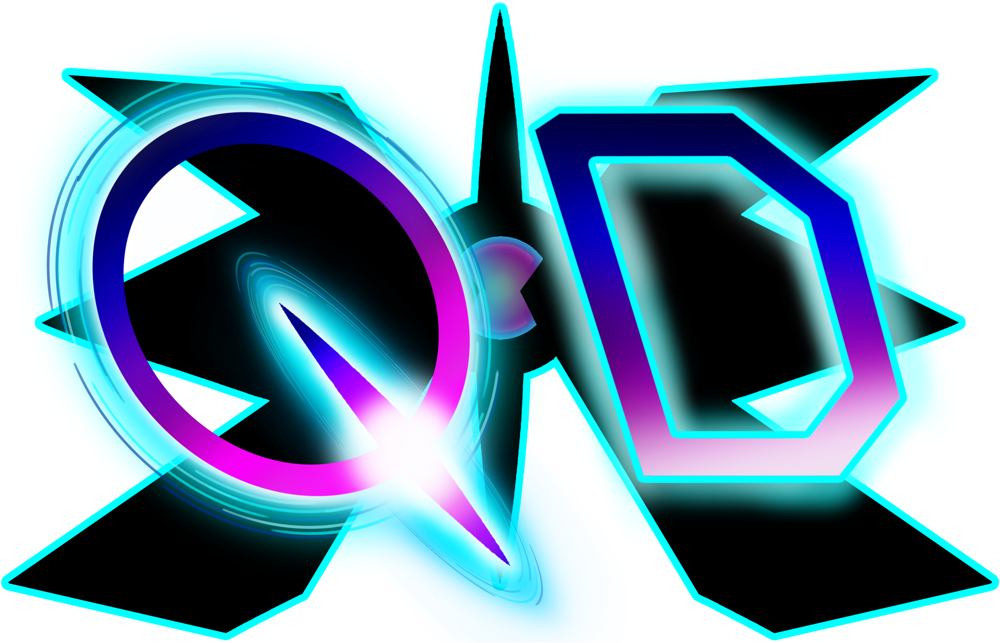
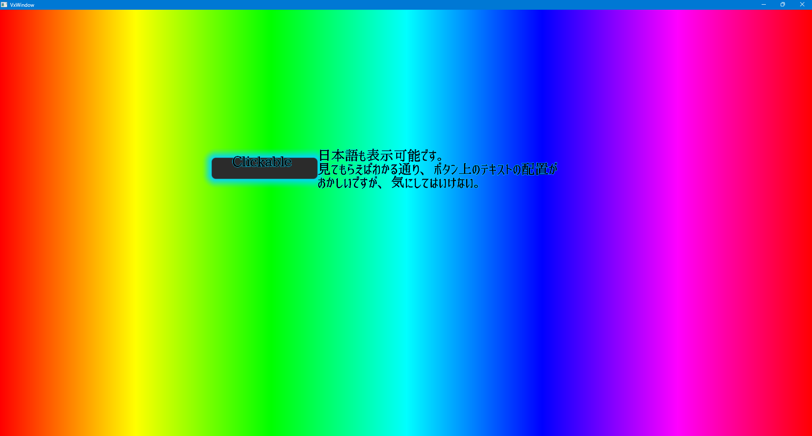
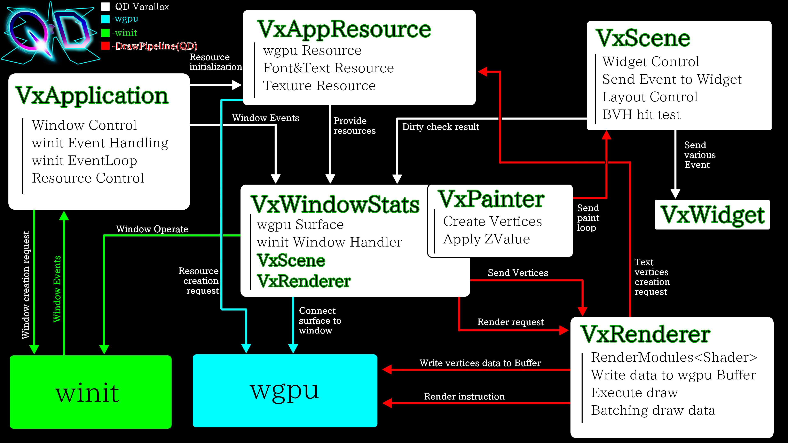

<div align = "center">
	<picture>
		
	</picture>
	<h1>QuantumDivision Vector Parallax</h1>
		<a href = "https://www.rust-lang.org/">
			
		</a>
		<a href = "https://gpuweb.github.io/gpuweb/">
			
		</a>
		<a href = "https://wgpu.rs/">
			
		</a>
		<br>
		<a href = "https://crates.io/crates/winit">
			
		</a>
		<a href = "https://crates.io/crates/swash">
			
		</a>
		<a href = "https://crates.io/crates/fdsm">
			
		</a><br>
		<a href = "./LICENCE-MIT.txt">
			
		</a>
		<a href = "./LICENCE-APACHE.txt">
			
		</a>
</div>

# Overview
### <i>QuantumDivision Vector Parallax (QD-Varallax)</i><br>
is a high-performance GUI library built with `Rust` and `WebGPU`.

# Screenshot
<picture>
	
</picture>

### This screenshots demonstrates:
* A rainbow background rendered using 23,040(1,920x12)
<a href = "./qd-varallax/src/widgets/vx_widgets.rs">VxRectWidgets.</a>
* A placed <a href = "./qd-varallax/src/widgets/button.rs">VxButtonWidget</a>.
* Text rendering rendered by a <a href = "./qd-varallax/src/widgets/text.rs">VxTextWidget</a>.

# Features
* **Pure Rust**
* **Cross-platform surpport (5 major OSs + WebAssembly)**
* **Fully native GPU rendering**
* **MTSDF text rendering with efficient dynamic packing**
* **SDF-based shape rendering**
* **WideBVH-acceralated hit detection**
* **Thread-safe signal system**
* **Bindless texture system**
* **Efficient draw calls via batching optimization**
* **Highly extensible widgets and windows**
* **Hybrid Retained and Immediate mode rendering**
* **Reduced boilerplate via Derive and `macro_rules!` macros**

# Architecture
QD-Varallax implements an architecture roughly outlined in the diagram below:
<br><br>
<picture>
	
</picture>

## Main components
* <b><a href = "./qd-varallax/src/core/application.rs">VxApplication</a></b> -
Manages the `winit` EventLoop and WindowEvents, dispatching them to their respective windows.
* <b><a href = "./qd-varallax/src/core/resource.rs">VxAppResource</a></b> -
Manages the `wgpu` resources and maintains application-wide shared data.
* <b><a href = "./qd-varallax/src/core/renderer.rs">VxRenderer</a></b> -
A component that sorts vertices from <a href = "./qd-varallax/src/abstractions/abstract_windows.rs">VxWindowStats</a>,
writing them to a buffer and executing batch rendering.
* <b><a href = "./qd-varallax/src/abstractions/abstract_windows.rs">VxWindowStats</a></b> - 
Manages per-window resources serves as the core data for `VxWindow`.
* <b><a href = "./qd-varallax/src/painter/painter.rs">VxPainter</a></b> - 
Manages by `VxWindowStats` to generate vertices and rendering data for each widget during the `paint` event.
* <b><a href = "./qd-varallax/src/core/scene.rs">VxScene</a></b> - 
A component that manages widget instances and dispatches various events to `VxWidget`.
* <b><a href = "./qd-varallax/src/abstractions/abstract_widgets.rs">VxWidget</a></b> - 
The core trait for widgets. Implementing this trait and incorporating `VxWidgetStats` allows a type to function as a widget.

## Main Functions
### Application
* Manages `winit` events, converting and dispatching them to their respective windows. 
* Holds application-wide resources (`VxAppResource`) and provides references to them during relevant events.
* Manages all windows, drives the <i>dirty-check</i> loop, and automatically handles application exit.

### Widget
* Functions as a widget via implementing the `VxWidget` trait and deriving <a href = "./vx_macro/src/lib.rs">`VxWidgetDerive`</a>.
* Managed centrally by `VxScene`. By hoding the ID and type information within
<a href = "./qd-varallax/src/abstractions/abstract_widgets.rs">`VxWidgetHandler`</a>,
the actual widget instance can be retrieved from the scene.
* Adopts the <b>bounding_rect</b> format, which is used for partial updates and hit detection.

### Renderer
* Reduced boilerplate via per-shader render modules (<a href = "./qd-varallax/src/core/renderer.rs">VxRenderModule</a>).
* Sorts vertices created by <a href = "./qd-varallax/src/painter/painter.rs">`VxPainter`</a> by Z-Value, writes them to a `wgpu::Buffer`,
and leverages custom draw batching for efficient rendering.
* Monitors buffer capacity and reallocates with a 1.5x scale factor when insufficent.

### Texture & Font system
* Efficient rendering via a bindless texture system.
* Prevents access to deleted elements and enables high-speed access via generatinal managements with
<a href = "./qd-varallax/src/types/genelational_vector.rs">`VxGenVector`</a>.

### Scene
* Manages all widget instances.
* Dispatches input events received from `VxWindow` to the appropriate widgets.
* Utilizes a `WideBVH`(Bounding Volume Hierarchy) via
<a href = "./qd-varallax/src/core/bvh.rs">`VxSpatialIndex`</a> (powered by `parry2d`) to acceralate
hit detection, reducing the search complexity from <b><i>O(n)</i></b> to <b><i>O(logN)</i></b>.
* Dispatches the `VxPainter` received from `VxWidgetStats` to all top-level widgets, and recursively to their child widgets.

# Quick start
This is a minimal example of creating a window using 
<a href = "./qd-varallax/src/widgets/default_window.rs">`VxDefaultWindow`</a>.

```rust
// Hide the console window for Windows release builds. (Highly recommended!!!)
#![cfg_attr(not(debug_assertions), windows_subsystem = "windows")]

use qd_varallax::{
	core::application::VxApplication,
	widgets::default_window::VxDefaultWindow,
};

fn main() {
	// Create the application
	let mut app = VxApplication::new();

	// Create the window
	let window = VxDefaultWindow::new(Default::default());

	// Register the window as the initial window.
	app.add_window(window);

	// Start the application loop
	app.exec();
}
```

# Roadmap
Current status of implemented and missing features.

### Implemented Features
* [x] Setting up the wgpu pipeline
* [x] MTSDF text rendering & atlas packing algorithm
* [x] Shape rendering using SDF
* [x] WideBVH-based hit detection
* [x] Thread-safe signal system

### Planned Features / Todo
* [ ] Support for 5 major OSs + WebAssembly
* [ ] Partial switching between Retained and Immediate modes (half completed)
* [ ] IME input support
* [ ] Layout engine / Layout features
* [ ] Accessbility support
* [ ] Implmentation of detailed/basic widgets
* [ ] <b>And so much more!!!!!!!!!!</b>

# License
QD-Varallax is distributed under the terms of both the Apache License (Ver-2.0) and MIT License.
* **Apache License, Ver-2.0** ([LICENSE-APACHE](./LICENSE-APACHE.txt) or http://www.apache.org/licenses/LICENSE-2.0)
* **MIT License** ([LICENSE-MIT](./LICENSE-MIT) or http://opensource.org/licenses/MIT)

Feel free to choose whichever license suits your needs best and use it however you like!

# Extra
### 2026-06-15
I’m thinking of switching the hit detection from a pure WideBVH implementation to a TLAS/BLAS setup. WideBVH on its own doesn’t handle dynamic objects very well, so I figured it’s not really cut out for GUIs.
<br>

### 2026-07-09
Just dropped a new video! Also, regarding the TLAS/BLAS setup I mentioned earlier, I've decided to go with a HybridBVH(HBVH). Without getting too into the weeds, 
the plan is to manage things using a flat BVH combined with dedicated BLAS for specific widgets. I'm expecting to heavily cut down on rebuild costs.

### 2026-07-15
I finally managed to make Retained and Immediate coexist!!!! I am officially overwhelmed with emotion.

<br><br>
<details>
	<summary><h1>日本語バージョン(クリックで展開)</h1></summary>

# 概要
<b>「QuantumDivision Vector Parallax」</b><br>
略して「QD-Varallax」は、RustとWebGPUを使用した、超高速マルチプラットフォームGUIフレームワークです。
<br><br>

# スクリーンショット
<picture>
	
</picture>
背景のゲーミングカラーは
<a href = "./qd-varallax/src/widgets/vx_widgets.rs">VxRectWidget</a>
を23,040(1920x12)個使って描画しています。<br>また、
<a href = "./qd-varallax/src/widgets/button.rs">VxButtonWidget</a>
を配置し、
<a href = "./qd-varallax/src/widgets/text.rs">VxTextWidget</a>
を使いテキストを表示しています。
<br><br>

# 特徴
* **純Rust製**
* **5大OS+WASM対応**(理論上)
* **完全ネイティブGPU描画**
* **テキストのMTSDF描画&効率的な動的パッキング**
* **SDFを使った図形描画**
* **WideBVHヒット判定**
* **スレッドセーフシグナルシステム**
* **バインドレステクスチャシステムの採用**
* **バッチング最適化による描画命令の効率化**
* **ウィジェット、ウィンドウの高い拡張性**
* **RetainedとImmediateの部分的切り替え機能**
* **Derive、macro_rules!マクロによるテンプレートの削減**
<br><br>

# アーキテクチャ
QD-Varallaxでは、大まかに以下の図(英語版と共通)のようなアーキテクチャを構築しています。
<br><br>
<picture>
	
</picture>
## 主要コンポーネント
* <b><a href = "./qd-varallax/src/core/application.rs">VxApplication</a></b> - winitのイベントループとウィンドウイベントを管理し、それぞれのウィンドウに振り分ける。
* <b><a href = "./qd-varallax/src/core/resource.rs">VxAppResource</a></b> - wgpuのリソースを管理し、アプリ共通のデータを保有&管理する。
* <b><a href = "./qd-varallax/src/core/renderer.rs">VxRenderer</a></b> - <a href = "./qd-varallax/src/abstractions/abstract_windows.rs">VxWindowStats</a>から
受け取った頂点をソートしてバッファに書き込み、バッチング描画を実行するコンポーネント。
* <b><a href = "./qd-varallax/src/abstractions/abstract_windows.rs">VxWindowStats</a></b> - ウィンドウ単位のリソースを管理し、ウィンドウ本体のデータとして動作する。
* <b><a href = "./qd-varallax/src/painter/painter.rs">VxPainter</a></b> - `VxWindowStats`により管理され、paintループでウィジェットの頂点や描画データを作成する。
* <b><a href = "./qd-varallax/src/core/scene.rs">VxScene</a></b> - ウィジェット本体を管理し、ウィジェットへ各イベントを配信するコンポーネント。
* <b><a href = "./qd-varallax/src/abstractions/abstract_widgets.rs">VxWidget</a></b> - 
ウィジェット本体となるトレイト。このトレイトを継承し、`VxWidgetStats`を持たせることで、ウィジェットとして動作する。

## 主要機能
### アプリケーション
* `winit`のイベントを管理し、各ウィンドウに適切なイベントを変換して振り分ける。
* アプリケーション全体のリソース(`VxAppResource`)を保有し、必要となるイベントで参照を渡す。
* 全てのウィンドウを管理し、描画チェックのループや、アプリケーションの終了などを自動で行う。

### ウィジェット
* <a href = "./qd-varallax/src/abstractions/abstract_widgets.rs">VxWindow</a>
トレイトを継承し、<a href = "./vx_macro/src/lib.rs">VxWidgetDerive</a>マクロを使うことで、ウィジェットとして動作させることが出来る。
* <a href = "./qd-varallax/src/core/scene.rs">VxScene</a>
で一括管理され、
<a href = "./qd-varallax/src/abstractions/abstract_widgets.rs">VxWidgetHandler</a>
にIDと型情報を持たせることで、<br>`VxScene`から実体を取得することが出来る。
* `VxScene`から、適切なインプットイベントや、paintイベントが自動で呼ばれるようになっており、<br>
ウィジェット側で自由にイベントをオーバーライドして、様々な動作を作ることが出来る。
* <b>bounding_rect</b>形式を採用しており、部分的な更新や、当たり判定などに使用する。

### レンダラー
* シェーダー単位のレンダーモジュール構造体を作成し、テンプレートを削減。
* <a href = "./qd-varallax/src/painter/painter.rs">VxPainter</a>
が作成した頂点を、Z値でソートしたうえで`wgpu::Buffer`に書き込み、<br>
独自の描画バッチングにより効率的に描画。
* バッファサイズを確認し、足りなくなった際、必要サイズの1.5倍で再確保する設計。

### テクスチャ&フォントリソース
* バインドレステクスチャシステムにより、描画が効率的。
* <a href = "./qd-varallax/src/types/genelational_vector.rs">VxGenVector</a>
による世代管理により、削除済み要素へのアクセスを防止&高速なアクセスを実現。

### シーン
* ウィジェット本体を全て管理。
* <a href = "./qd-varallax/src/abstractions/abstract_windows.rs">VxWindow</a>
から受け取ったインプットイベントを、適切なウィジェットに配信する。
* <a href = "./qd-varallax/src/core/bvh.rs">VxSpatialIndex</a> (`parry2d`を使用)
による<b>WideBVH</b> (Bounding Volume Hierarchy)<br>
を使った高速ヒット判定を実現。従来の
<i><b>O(n)</b></i> 回のウィジェット探索ループから、<i><b>O(log N)</b></i>
回まで減少。
* <a href = "./qd-varallax/src/abstractions/abstract_windows.rs">VxWidgetStats</a>
から受け取った
<a href = "./qd-varallax/src/painter/painter.rs">VxPainter</a>を、全てのトップレベルウィジェットに配信し、子ウィジェットにも再帰的に配信する。


# クイックスタート
<a href = "./qd-varallax/src/widgets/default_window.rs">デフォルトの空のウィンドウ</a>
を使用してウィンドウを出す最小構成例です。

```rust
// Windowsでリリースビルド時に、ターミナルを非表示にする設定(オヌヌメ)
#![cfg_attr(not(debug_assertions), windows_subsystem = "windows")]

use qd_varallax::{
	core::application::VxApplication,
	widgets::default_window::VxDefaultWindow,
};

fn main() {
	// アプリケーションを作成
	let mut app = VxApplication::new();

	// ウィンドウを作成
	let window = VxDefaultWindow::new(Default::default());

	// ウィンドウを初期ウィンドウとして登録
	app.add_window(window);

	// アプリケーションループを開始
	app.exec();
}
```
<br>

# ロードマップ
現状実装できているもの、できていないものについてです。

### できているもの
* [x] wgpuパイプラインの整備
* [x] テキストのMTSDF描画&アトラスパッキングアルゴリズム
* [x] SDFを使った図形描画
* [x] BVHヒット判定
* [x] スレッドセーフシグナルシステム

### できていないもの
* [ ] 5大OS+WASM対応
* [ ] RetainedとImmediateの部分的切り替え機能(半分できてる)
* [ ] IME入力への対応
* [ ] レイアウト機能
* [ ] アクセシリビティへの対応
* [ ] 細かなウィジェットの実装
* [ ] そのほか諸々！！！
<br><br>

# ライセンス
QD-Varallaxは、以下のデュアルライセンスのもとで提供されています。

* **Apache License, Version 2.0** ([LICENSE-APACHE](/LICENSE-APACHE.txt)、または http://www.apache.org/licenses/LICENSE-2.0)
* **MIT License** ([LICENSE-MIT](./LICENSE-MIT)、または http://opensource.org/licenses/MIT)

お好きな方を選んでお好きなようにお使いください。

# 開発中のおまけ
### 2026-06-15
ヒット判定を、純WideBVH実装からTLAS/BLAS実装に変えようと思います。BVH単体だと動体に弱かったので、GUIに不向きだな～と思って。
<br>

### 2026-07-09
動画を出しました。あと、上のTLAS/BLASの話について、HBVH(HybridBVH)にすることにしました。詳細は省きますが、フラットなBVHと、特定のウィジェット限定のBVH(BLAS)で管理することで、
再構築コストを激減させる算段です。
<br>

### 2026-07-15
遂にRetainedとImmediateを共存させることに成功しました!!!!感動に咽ぶ系感動に咽ぶ者ですこんにちは。
</details>